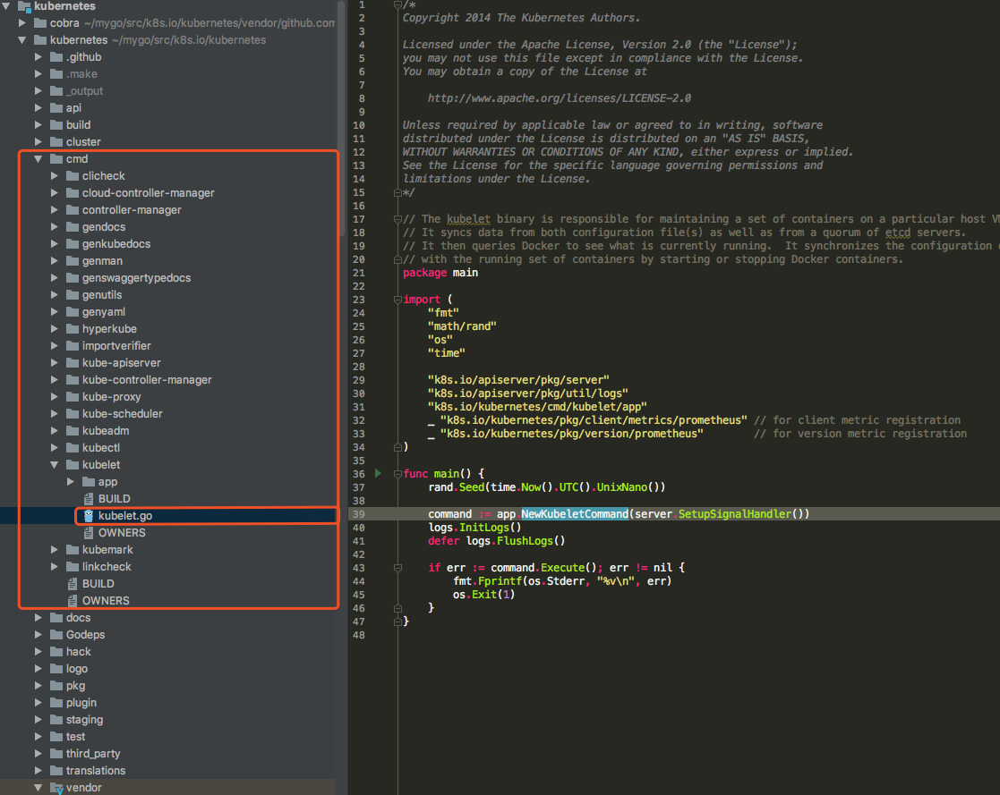

# kubelet

## kubelet大致说明

kubelet是在每个上运行的主要“节点代理”节点。 kubelet适用于PodSpec。

PodSpec是YAML或JSON对象描述一个pod。 

kubelet采用通过提供的一组PodSpecs各种机制（主要通过apiserver）并确保容器在那些PodSpecs中描述的运行和健康。
 
kubelet无法管理不是由Kubernetes创造的容器。 

除了来自apiserver的PodSpec之外，容器有三种方式清单可以提供给Kubelet。

File：Path在命令行上作为标志传递。将监视此路径下的文件定期更新。监控时间默认为20秒，可配置通过一面旗帜。

HTTP端点：在命令行上作为参数传递的HTTP端点。这个端点每20秒检查一次（也可以用标志配置）。

HTTP服务器：kubelet还可以侦听HTTP并响应简单的API（目前未提及）提交新清单。

## kubelet源码分析流程



1. main入口：k8s.io\kubernetes\cmd\kubelet\kubelet.go

```go
    func main() {
        rand.Seed(time.Now().UTC().UnixNano()) // 获取一个随机数
    
        command := app.NewKubeletCommand(server.SetupSignalHandler()) //初始化一个kubeletCommand的入口
        logs.InitLogs() // 初始化日志
        defer logs.FlushLogs()// 日志结束
    
        if err := command.Execute(); err != nil { // command初始化后，执行
            fmt.Fprintf(os.Stderr, "%v\n", err)
            os.Exit(1)
        }
    }
```
这个main函数是不是大家看着很亲切的感觉，我有这种感觉，就像发现新大陆一样

既然有这个main这个主入口，我们就分析代码，上面有注释，这里主要学习 NewKubeletCommand 函数;

大家有可能发现部分问题，历史老版本，这个NewKubeletCommand没有参数传入的，现在新版本是传入的。

参数为一个 chan struct{} 这种参数传入，非常方便。比较灵活。。。

2.  NewKubeletCommand函数分析
```go
    // NewKubeletCommand使用默认参数创建*cobra.Command对象
    func NewKubeletCommand(stopCh <-chan struct{}) *cobra.Command {
    
        // NewFlagSet返回一个新的空标志集，其中包含指定的名称，错误处理属性和SortFlags设置为true。
        cleanFlagSet := pflag.NewFlagSet(componentKubelet, pflag.ContinueOnError) 
      
      // SetNormalizeFunc允许您添加一个可以转换标志名称的函数。
      // 添加到FlagSet的标志将被翻译，然后当有任何东西试图查找也将被翻译的标志时。所以有可能创造 一个名为“getURL”的标志，并将其翻译为“geturl”。
      // 然后用户可以传递“--getUrl”，它也可以被翻译成“geturl”，一切都会正常工作。
        cleanFlagSet.SetNormalizeFunc(flag.WordSepNormalizeFunc)
        
        // NewKubeletFlags将使用默认值创建一个新的KubeletFlags
        kubeletFlags := options.NewKubeletFlags()
        
        // NewKubeletConfiguration将使用默认值创建新的KubeletConfiguration
        kubeletConfig, err := options.NewKubeletConfiguration()
        // programmer error
        if err != nil {
            glog.Fatal(err)
        }
    
        // 分装 command 结构
        cmd := &cobra.Command{
            Use: componentKubelet,
            Long: `... 一大堆文字说明，此处略...`,// 一大堆文字说明，此处略
            
            //  Kubelet具有特殊的标志解析要求来强制执行标志优先级规则，所以我们在下面的Run中手动完成所有解析。
            // DisableFlagParsing = true提供传递给kubelet的完整标志集`args` arg to Run，没有眼镜蛇的干扰。
            DisableFlagParsing: true,
            Run: func(cmd *cobra.Command, args []string) {...}, // `这里面放置一个匿名函数，后面详细说，看着代码就是比较多`
        }
    
        // 保持cleanFlagSet分开，因此Cobra不会用全局标志污染它
        kubeletFlags.AddFlags(cleanFlagSet)
        
        // AddKubeletConfigFlags将特定kubeletconfig.KubeletConfiguration的标志添加到指定的FlagSet
        options.AddKubeletConfigFlags(cleanFlagSet, kubeletConfig)
        
        // AddGlobalFlags显式地注册库（glog，verflag等）从“flag”和“github.com/spf13/pflag”注册全局标志集的标志。
        // 我们这样做是为了防止不需要的标志泄漏到Kubelet的标志集中。
        options.AddGlobalFlags(cleanFlagSet)
        cleanFlagSet.BoolP("help", "h", false, fmt.Sprintf("help for %s", cmd.Name()))
    
        // gly, but necessary，因为Cobra的默认UsageFunc和HelpFunc用全局标志影响flagset
        const usageFmt = "Usage:\n  %s\n\nFlags:\n%s"
        cmd.SetUsageFunc(func(cmd *cobra.Command) error {
            fmt.Fprintf(cmd.OutOrStderr(), usageFmt, cmd.UseLine(), cleanFlagSet.FlagUsagesWrapped(2))
            return nil
        })
        
        cmd.SetHelpFunc(func(cmd *cobra.Command, args []string) {
            fmt.Fprintf(cmd.OutOrStdout(), "%s\n\n"+usageFmt, cmd.Long, cmd.UseLine(), cleanFlagSet.FlagUsagesWrapped(2))
        })
    
        return cmd
    }
```
上面的两个地方，内容篇幅过大，都删除了，做了文字说明。如果代码删减后，代码看着就比较清爽。详细看注释说明！！！
 

#### 参考文件

[k8s源代码分析-----kubelet（1）主要流程](https://www.cnblogs.com/slgkaifa/p/7308368.html)